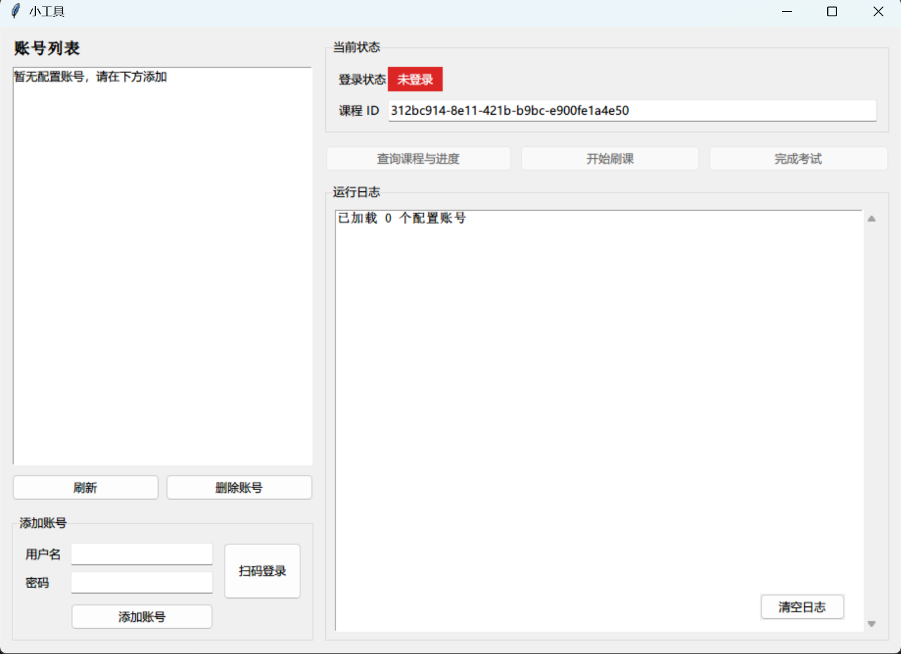

# AutoBaomiGuan

[保密观](https://www.baomi.org.cn) 自动刷课、答题脚本，支持命令行与 Windows 图形界面。

> [!IMPORTANT]
> 此脚本适用于 [2026 年度全国保密教育线上培训](https://www.baomi.org.cn/bmCourseDetail/info?id=312bc914-8e11-421b-b9bc-e900fe1a4e50)

## 项目结构

```
├── config.yaml        # 配置文件
├── login.py           # 登录：RSA 加密登录 + 扫码登录
├── course.py          # 课程目录、进度、刷课与考试逻辑
├── main.py            # 命令行入口 + 配置读写
├── gui.py             # Windows 图形界面入口
├── ScreenShot/        # 界面截图
└── requirements.txt   # Python 依赖
```

## 功能

- 多账号管理
- 两种登录方式：账号密码登录、扫码登录
- 查看课程目录与学习进度
- 自动完成视频课程学习
- 自动拉取试卷并提交答案（满分）

## 使用方法

1. 安装依赖：

   ```bash
   pip install -r requirements.txt
   ```

2. 编辑 `config.yaml`，配置课程 ID 与账号（账号可留空，运行时再添加或扫码登录）：

   ```yaml
   # 课程 ID（2026 年度保密教育线上培训）
   course_packet_id: "312bc914-8e11-421b-b9bc-e900fe1a4e50"
   
   # 多账号配置
   accounts:
     - loginName: "151xxxxxxxx"
       passWord: "xxxx"
       token: ''
       timestamp: 0
       label: "示例账号"
       nickName: "张三"
   ```

   - `label` 为可选备注，便于识别账号。

### 命令行

```bash
python main.py
```

启动后按优先级尝试登录：

1. **已保存的有效 token**：直接回车使用；多个账号时输入编号选择；输入 `n` 跳过。
2. **config.yaml 中配置的账号**：优先用缓存 token，过期则用密码重新登录。
3. **手动登录**：选择扫码登录或账号密码登录，成功后自动写回 `config.yaml`。

登录后在课程管理菜单选择功能：

| 选项 | 功能 |
|------|------|
| 1 | 查看课程目录 |
| 2 | 查看课程进度 |
| 3 | 开始学习课程（自动刷课） |
| 4 | 完成课程考试（自动答题） |
| 0 | 退出程序 |

### Windows 图形界面

```bash
python gui.py
```

或直接下载构建好的 `AutoBaomiGuanUI.exe`。

界面截图：



操作说明：

- **添加账号**：输入用户名、密码后点击「添加账号」。
- **扫码登录**：点击「扫码登录」用保密观 APP 扫码。
- **查询 / 刷课 / 考试**：先在左侧选中账号，再点击对应按钮；程序会按所选账号自动登录后执行。

## 致谢

感谢 [NB-XX/AutoBaomiGuan](https://github.com/NB-XX/AutoBaomiGuan) 项目。
